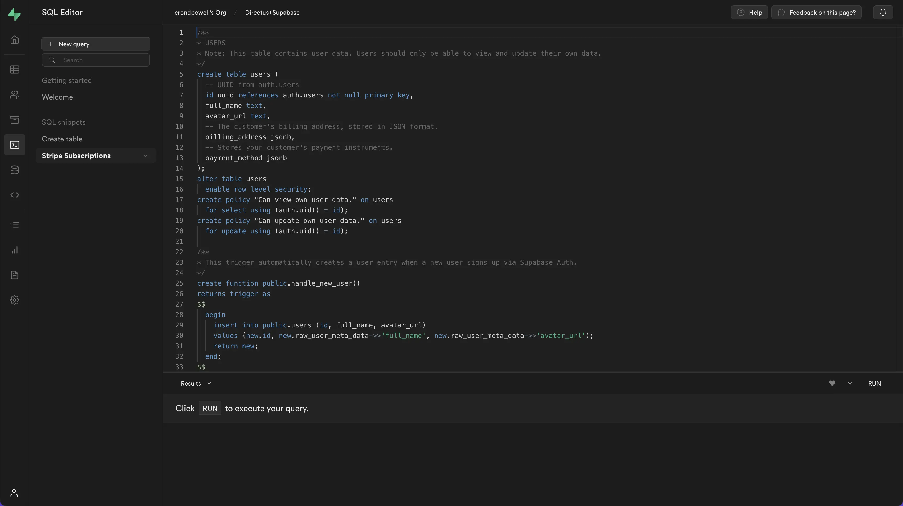
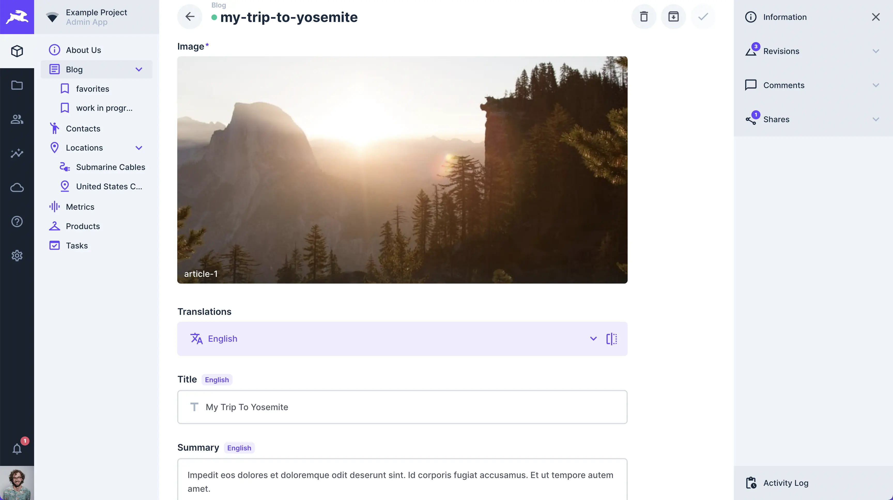
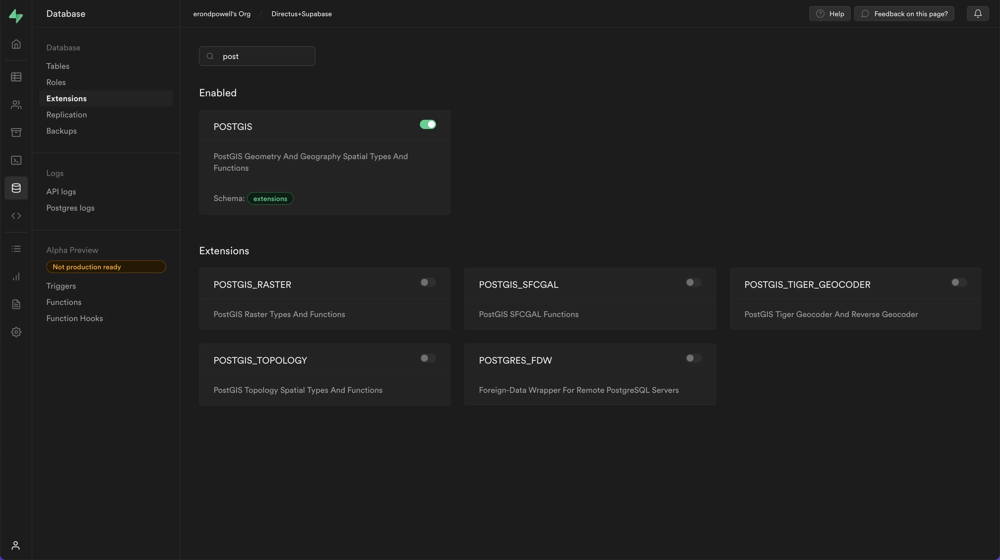

In this guide, we will demonstrate how to create a new Supabase project, install a fresh instance of the Directus platform, then configure the two to work together seamlessly. If you're unfamiliar with either of these systems, don’t worry! We’ll start off with an overview of each platform and explain how they complement each other, noting any overlap in capabilities.

## Introduction



**[Supabase](​​https://supabase.com/)** is an open-source Firebase alternative that provides a PostgreSQL database, storage, authentication, and a dynamic REST API based on your schema. While it is possible to self-host Supabase on your own infrastructure, this article will focus on Supabase Cloud’s Free tier, which is the fastest and easiest way to get started.



**Directus** is an open-source data platform that layers on top of any SQL database, providing a powerful suite of tools. The Directus Engine provides dynamic REST and GraphQL APIs based on your schema, hooks and automation, authentication and access control, and file transformations. Directus Studio enables engineers and non-technical users alike to browse, manage, and visualize database content through a no-code app.

---

Supabase is a suite of open-source tools making Postgres databases, file storage, authentication, and edge functions more accessible to developers of all skill levels. Directus is also developer tooling and additionally provides a Data Studio that is safe and intuitive enough for anyone, including non-technical users, to use. This is the crucial bit that gives the two platforms such a strong “network effect.”

When these two systems are brought together, you get a scalable datastore, limitless connectivity options, and a no-code app that allows your technical and business teams to collaborate together efficiently.

The two platforms share an overlap of capabilities that deepens their integration and offers developers the freedom of choice across a broader spectrum of connectivity. Key areas of intersection include:

The ability to generate *powerful* APIs dynamically to connect data
User management and fine-grained access control
Digital asset storage and management

More importantly, Directus and Supabase share a common vision for your data, making them quite symbiotic. Both solutions are completely open-source, with self-hosted and cloud deployment options available. They are unopinionated in their approach, with vendor-agnostic data storage, and they both focus on providing a polished developer experience along with comprehensive documentation.

By linking the Supabase database with your Directus Project, *you get a superset of data tools.* You'll benefit from Supabase's Postgres database and its *dev-centric* admin app with the raw power to run SQL queries, ***as well as*** the Directus no-code app, which enables intuitive permissions-based data access for the whole team.

Let’s dive into how we actually set up and link these two platforms to create a modern data stack powerhouse.

## Create a Supabase Project

As mentioned, while you can [deploy Supabase locally](https://supabase.com/docs/guides/local-development). For the purpose of this guide, we’ll use Supabase Cloud:

1. Create a **Supabase** account by signing in with GitHub.
2. Give your organization a name (this can be changed later).
3. Click **New Project** and select your organization.
4. Follow the prompts, setting a project Name, Database Password, Region, and Pricing Plan, then click **Create New Project**.
5. After your project has been provisioned, navigate to **Settings > Database** in the sidebar.
6. Scroll down to **Connection Info** and take note of your database’s **Host**, **Database Name**, **Port**, **User**, and **Password**. You will need to enter this during your Directus project setup.

## Optional: Add PostGIS to Support Geometry and Mapping

To take full advantage of the built-in geometry and mapping features Directus offers, we recommend enabling Geometric Data Support. To add PostGIS, follow these steps:



1. From the sidebar, navigate to **Database > Extensions**.
2. Use the search bar to look up `PostGIS`.
3. Toggle the PostGIS option to enable it.

## Set up Directus

At the time of writing this article, [Directus Cloud](https://directus.cloud/) does not yet support hybrid deployments for connecting an external database. So, we’ll be deploying a self-hosted instance to connect with Supabase. To install a self-hosted instance of Directus that’s connected to our Supabase project, follow these steps:

1. Run the following command in your terminal:

```bash
npm init directus-project example-project
```

2. Using the up/down arrow keys, select `Postgres` from the list:

```bash
? Choose your database client Postgres
```

3. Next, you will be prompted to input database credentials. Add in the Supabase Database Connection Info noted above as follows:

**Database Host** – The IP address for your database.\
**Port** – Port number your database is running on.\
**Database Name** – Name of your existing database.\
**Database User** – Name of existing user in database.\
**Database Password** – Password to enter database.\
**Enable SSL** – Select Y for yes or N for no.\
**Root** – The root name.

4. Now, simply set an email and password for your first Directus admin account. To be clear, this is Directus-specific, and is unrelated to your database user:

```bash
Create your first admin user:
? Email: admin@example.com
? Password: ********
```

Once this is complete, you should see details about your new project:

```bash
Your project has been created at <file-path>/example-project.
The configuration can be found in <file-path>/example-project/.env
```

5. Lastly, navigate to your new project folder (in this case `example-project`) and start the platform:

```bash
cd example-project
npx directus start
```
**Please note:** To prevent public accessibility when using the supabase-js library,turn on row level security (RLS) on all these tables inside of the Supabase Dashboard. By default when RLS is turned on these tables cannot be read from or written to with the supabase-js library.

That’s it! Your project is now up and running locally. You can access the Directus Studio in the browser via the URL displayed, and log in with the Directus admin credentials you entered above:

```bash
✨ Server started at http://localhost:8055
```

In a matter of minutes, we’ve created a flexible data backend, with access to an intuitive no-code app for managing and visualizing data along with a robust connectivity toolkit. This modern data stack is flexible and scalable enough to power any data-driven project… all you need to do is build the frontend!

## Next Steps

From here, the sky's the limit on what you can build. You’ll probably want to invite some new collaborators to your project and start architecting your data model.

Below are some additional resources to dive in and start exploring these two platforms:

**Directus**
- See the [Directus guides](https://directus.io/guides/).
- Join the Directus community on [Discord](https://directus.chat/).
- Check out the source code and give us a star on the official [Directus GitHub Repo](https://github.com/directus/directus).

**Supabase**
- Explore the [Supabase documentation](https://supabase.com/docs)
- Join the Supabase community on [Discord](https://discord.supabase.com/)
- Give Supabase a star on [Github](https://github.com/supabase/supabase)
