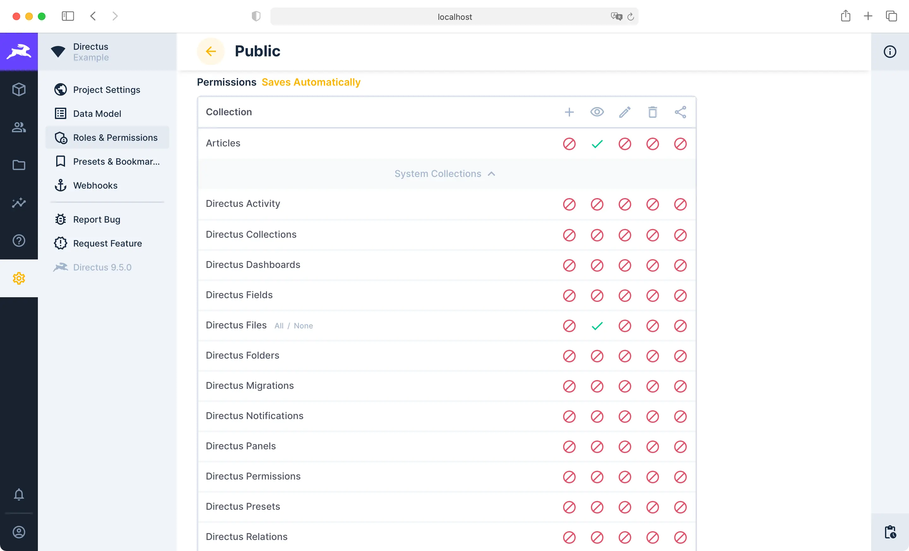

> This example will show you how to link a simple Iles frontend blog template to a Directus Project with a simple SQLite database containing a few blog posts.

[[toc]]

## Scope and Purpose

The purpose of this article is to focus on the bare basics of linking an Iles frontend to Directus, then show you where to learn about more robust authentication methods, roles & permissions configurations, and API functionalities. It is important to stress to new users that Directus is a general purpose database wrapper, _which mirrors any linked database_. No matter your data model or use-case, Directus can serve as a backend _(plus no-code admin panel)_ for any type of project and also connect to any _(or many)_ different front-ends.

Please keep in mind that this is not a demo showing _what Directus can be used for_, but rather a low variable entry-point on the path to _understanding how to do anything you want with it_.

::: warning Demonstration purposes only

This example was created for demonstration purposes and is not intended to be production ready, but PRs that address this and any other issues are always welcome! See [Contribution Guidelines](https://docs.directus.io/contributing/introduction/).

:::

## Setup

1. Clone the [examples repo](https://github.com/directus/examples).

::: warning Don't move the directories

Every frontend template in the `examples` repo references the `shared` folder. So moving these directories around from one location to another could break the relative file path.

:::

2. From that repo, setup the [provided Directus instance](https://github.com/directus/examples/tree/main/directus) and get it running. Instructions are on the `README.md` page.

3. Install dependencies for this example.

```
cd iles
pnpm install
```

4. Create a `.env` file for this Iles template by copying and pasting the provided `.env.example` file. Nothing will need to be changed in the copied `.env` file.

5. Start the development server.

```
npm run dev
```

6. Your Directus Iles example is now running at <http://localhost:3000>.

Now that you have the frontend and backend linked up, let's touch on what's happening in this project and where to find more sophisticated options.

## Iles

 [Iles](https://iles.pages.dev/guide/introduction) is a static-site generator (SSG) that provides great support for partial hydration. Use Vue and MDX to build your website, while enjoying the smooth development experience provided by Vite.js.

Also, please note the Directus JavaScript SDK is pulled in under `examples > iles > src > logic > directus.ts` _(find it [here](https://github.com/directus/examples/blob/main/iles/src/logic/directus.ts))_. If you'd like to learn more, checkout the [SDK documentation](https://docs.directus.io/reference/sdk/).

## Authentication

Aside from the default `local` authentication mechanism, Directus also supports SSO through `oauth2`, `openid`, and `ldap`. To learn more about SSO options, read our [SSO Documentation](https://docs.directus.io/configuration/config-options/#authentication) or follow our guide on [how to setup SSO](https://docs.directus.io/configuration/sso/).

## Users, Roles and Permissions



For simplicity's sake, this Directus instance provided has [Public read permissions](https://docs.directus.io/getting-started/quickstart/#_6-set-role-public-permissions) activated for `articles` and `directus_users`. Find Permissions in your [local Directus Instance](http://localhost:8055/admin/settings/roles/public) under `Settings > Roles and Permissions`.

Additionally, any number of Roles can be created and fully configured. Permissions are completely granular. Learn more about this in our documentation on [Users, Roles and Permissions](https://docs.directus.io/configuration/users-roles-permissions/).

## APIs

There is one simple request in this example worth noting, in `article.ts`. If you'd like to see, here is a link to [article.ts](https://github.com/directus/examples/blob/main/iles/src/logic/article.ts) on GitHub. However, please note that the Directus API is exhaustive for any database linked.

Directus uses [Database Mirroring](https://docs.directus.io/getting-started/introduction/#database-mirroring) to dynamically generate REST endpoints and a GraphQL schema based on the connected database's architecture. This means the REST and the GraphQL APIs _will both fit any project with any database schema, out of the box_. Learn more in the [API Reference](https://docs.directus.io/reference/introduction/).

## More Help

Looking for technical support for your non-enterprise project? Please visit the [Directus Discord Community](https://directus.chat/).

Want to stay focused on your content and apps? Let Directus manage the platform with our [Directus Cloud service](https://directus.io/pricing/) or [contact our team](https://directus.io/contact/).